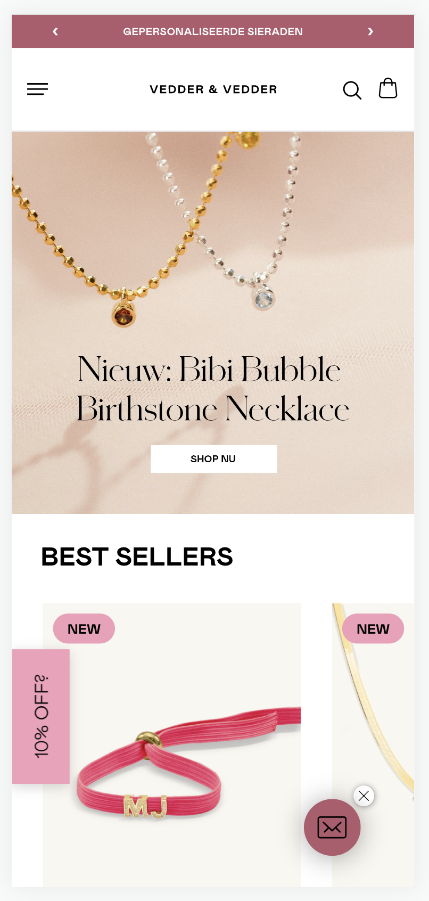
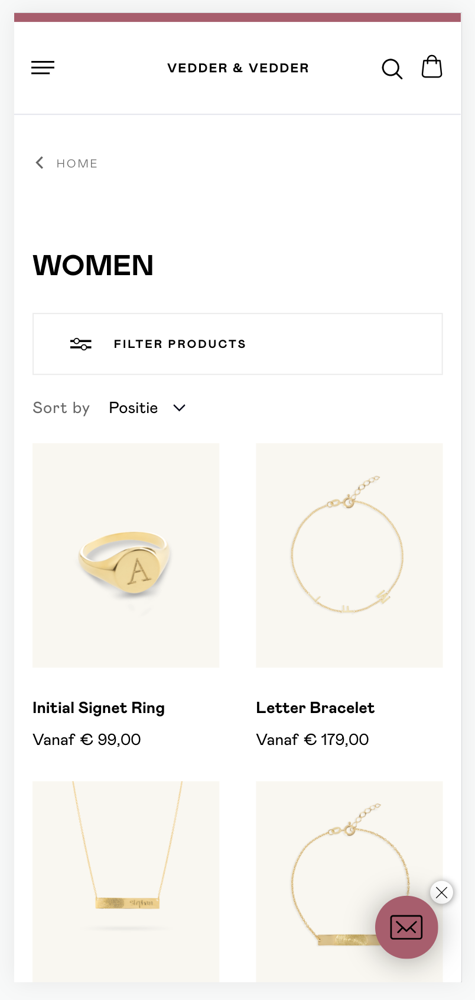
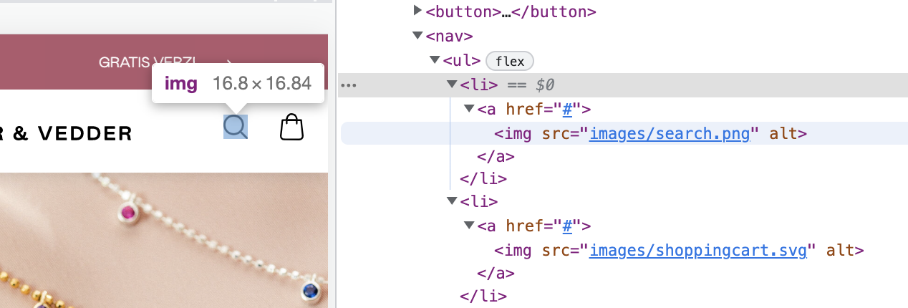
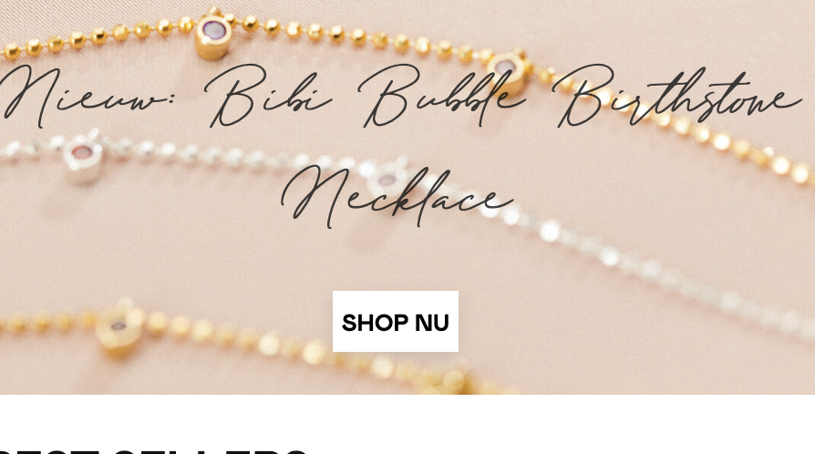
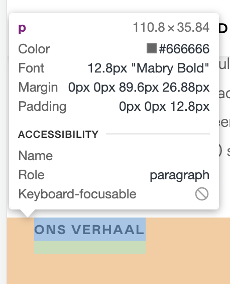

# Procesverslag
Markdown is een simpele manier om HTML te schrijven.  
Markdown cheat cheet: [Hulp bij het schrijven van Markdown](https://github.com/adam-p/markdown-here/wiki/Markdown-Cheatsheet).

Nb. De standaardstructuur en de spartaanse opmaak van de README.md zijn helemaal prima. Het gaat om de inhoud van je procesverslag. Besteedt de tijd voor pracht en praal aan je website.

Nb. Door *open* toe te voegen aan een *details* element kun je deze standaard open zetten. Fijn om dat steeds voor de relevante stuk(ken) te doen.

## Jij

  
uitwerken voor kick-off werkgroep

  ### Auteur:
  Shelley Schelhaas

  #### Je startniveau:
  Ik zou zeggen blauw, maar ga graag voor rood 

  #### Je focus:
  Surface plane
 

## Je website

  
uitwerken voor kick-off werkgroep

  ### Je opdracht:
  https://www.vedder-vedder.com/

  #### Screenshot(s) van de eerste pagina (small screen): 
  Vedder & Vedder homepage:
  

  #### Screenshot(s) van de tweede pagina (small screen):
  Vedder & Vedder artikelpagina:
  
 

## Toegankelijkheidstest 1/2 (week 1)

  
uitwerken na test in 1e werkgroep

  ### Bevindingen
  Lijst met je bevindingen die in de test naar voren kwamen:

  #### Screenreader
  * Bij het kiezen van een product is het niet mogelijk om met de screenreader optie een anders soort materiaal, lengte etc. te kiezen via het drowpdown menu. 
  * Er is geen hover state voor het menu, je gaat direct naar de product pagina.
  * De linkjes vind ik duidelijk aangezien je hier de naam van het product en de vanaf prijs hoort. 
  
  Hier een omschrijving van hoe het opgelost kan worden (met indien nodig afbeeldingen)
  - De code moet herschreven worden waardoor het menu openklapt en je hierdoor heen kan door omhoog en omlaag
  - Dit kan volgens Sanne opgelost worden via JavaScript

  #### Muis en Toetsenbord 
  Hier korte omschrijving (met indien nodig afbeeldingen)

  Hier een omschrijving van hoe het opgelost kan worden (met indien nodig afbeeldingen)

  #### Motoriek (shocks, elastiekjes)
  * De website is redelijk goed te bedienen tijdens de shocks en met de elastiekjes om. Dit aangezien de buttons/knoppen vrij groot zijn en je hier dus goed om kan klikken. 

  #### Visueel (brillen, contrast, kleurenblind, dark/light). 
  * Door de wazige bril is het lastig om de tekst te lezen op de website aangezien dit erg dun is. De koppen zijn inprincipe wel goed leesbaar. 

## Breakdownschets (week 1)

  
uitwerken na afloop 2e werkgroep

  ### de hele pagina: 
  

  ### dynamisch deel (bijv menu): 
  !!!!!!!!!!! nog invullen

  ### wellicht nog een dynamisch deel (bijv filter): 
  !!!!!!!!!!! nog invullen

## Voortgang 1 (week 2)

  
uitwerken voor 1e voortgang

  ### Stand van zaken
De verwachting ging beter dan gedacht bij mijn eerste voortgang. Vanaf het begin ben ik gestart met mijn HTML en ben nu begonnen met mijn CSS. Ik merk dat ik soms moeten heb met de verschillende selectoren en het omdraaen van volgordes. 

  ### Agenda voor meeting
  samen met je groepje opstellen
  - Elaine: Hamburger Menu | Position Fixed 
  - Shelley: Verplaatsen Container CSS | Hamburger Menu 
  - Lisanne: Nog werken aan HTML
  - Karenza: Geen vragen

  ### Verslag van meeting
  - Goede voortgang, verder gaan met het menu maken en javascript neerzetten. 
  - H1 maar eenmalig gebruiken 
  - Gebruik maken van Aria Labels. 

## Voortgang 2 (week 3)

  
uitwerken voor 2e voortgang

  ### Stand van zaken
  De week ging over het algemeen goed! Het is gelukt om een carousel te maken met flex en grid. Het enige wat ik nog lastig vind is het juist positioneren van het grid. 

  ### Agenda voor meeting
  samen met je groepje opstellen

  - Elaine: Button verplaatsen | Javascript textcontent met carousel
  - Shelley: Display Grid en posities van de children correct neerzetten
  - Lisanne: HTML nog net zo ver
  - Karenza: Geen vragen

  ### Verslag van meeting
  Tevreden met de voortgang. Het gaat de goede kant op, uitleg gekregen over het grid en het beter positioneren hiervan. 

  - CSS opruimen en custom properties toepassen 
  - Grid kloppend laten maken in de "Best Seller" section

## Toegankelijkheidstest 2/2 (week 4)

  
uitwerken na test in 8e werkgroep

  ### Bevindingen
  Het testen ging over het algemeen goed. Ik heb de links interactiever gemaakt dan op de originele website zodat de gebruiker door heeft dat het klikbaar is en hier een response voor krijgt. 
  
  De originele website heeft geen darkmode en ik wil hier nog mee aan de slag. 

  #### Screenreader
  1. Ik moet nog een alt text toevoegen aan de navigatie, nu krijgt de gebruiker met screenreader hier geen informatie over waar hij/zij zich bevindt. 
  
  ALT TEXT:
  

  2. Ik ben tevereden over de rest van de screenreader, ik kan zien dat mijn HTML goed is opgebouwd en de structuur visueel goed is aangepast met CSS (flex/grid). 

  1. Punt 1 kan eenvoudig worden toegevoegd door de Alt text in te vullen. 

  #### Muis en Toetsenbord 
  1. Het menu tabt weg omdat deze buiten de pagina staat  wanneer er niet op geklikt wordt. Deze tabs zie je dus niet in het beelscherm tenzij het menu geopend is. 

  2. De afbeeldingen en h3s zijn niet tabbaar in de section van: "Best  Sellers". 

  1. Punt 1 is op te lossen met Javascript. Ik ga nog even onderzoeken of dit mij lukt, maar als dit niet lukt was dit ook geen probleem. 

  2. Punt 2 is op te lossen door linkjes te maken van de h3's en 

  #### Motoriek (shocks, elastiekjes)
  1. <b>Shocks:</b> Het viel op dat het scrollen prima ging, ook door het carousel.  Wellicht is het een optie om toch nog extra knoppen toe te voegen  zodat je hier ook doorheen kan klikken i.p.v. slepen of vegen met het trackpad. Verder zijn de: shop nu button en de footer erg klein en moeilijk klikbaar. De text van de links is groot genoeg maar hier kan misschien nog wat padding-top toegevoegd worden zodat het veld groter wordt waarop geklikt kan worden en dit visueel niet zichtbaar is. 
  
  SHOP NU:
  

  LINKS:
  

  2. <b>Ballon:</b> Het viel op dat de tekst van "over ons" nu aan de lange kant is. Misschien is het een goede optie om hier eerder een lees meer optie van te maken. Mensen haken natuurlijk sowieso snel af wanneer ze veel tekst moeten lezen. Voor de screenreader zou je hier een class en span aan toe kunnen voegen waarbij dit visueel verdwijnt maar de informatie nog wel beschikbaar is zonder verder te klikken. 

  #### Visueel (brillen, contrast, kleurenblind, dark/light). 
  1. <b>Blur:</b> De blur zorgt ervoor dat erg veel onleesbaar wordt. De headers zijn leesbaar maar de rest van de tekst valt weg, de header voor Kindercollectie is wel heel erg onduidelijk. De Footer is sowieso te klein voor  mensen met deze beperking. Het is mogelijk dit op te lossen door een extra modus toe te voegen zoals de darkmodus maar dan dikkere en grotere tekst te gebruiken, maar ik zou deze mensen in principe de screenreader aanbevelen. 

  2. <b>Contrast:</b> De kleuren van de huisstijl zijn over het algemeen goed qua contrast, het is voor mij belangrijk dat ik goed ga kijken naar het contrast voor de dark mode aangezien de website dit nog niet heeft en ik dit zelf moet gaan inschatten. Dit kan ik doen met behulp van de inspector.  

## Voortgang 3 (week 4)

  
uitwerken voor 3e voortgang

  ### Stand van zaken
  hier dit ging goed & dit was lastig (neem ook screenshots op van delen van je website en code)

  ### Agenda voor meeting
  samen met je groepje opstellen

  - Elaine:
  - Shelley:
  - Karenza: 
  - Lisanne: 

  ### Verslag van meeting
  hier na afloop snel de uitkomsten van de meeting vastleggen

  - punt 1
  - punt 2
  - nog een punt
  - ...

## Eindgesprek (week 5)

  
uitwerken voor eindgesprek

  ### Je uitkomst - karakteristiek screenshots:
  

  ### Dit ging goed/Heb ik geleerd: 
  Korte omschrijving met plaatjes

  

  ### Dit was lastig/Is niet gelukt:
  Korte omschrijving met plaatjes

  

## Bronnenlijst

  
continu bijhouden terwijl je werkt

  Nb. Wees specifiek ('css-tricks' als bron is bijv. niet specifiek genoeg).

  1. Sanne van 't Hoofd - Front End Development leraar (hulp bij hambureger menu, grid en de link met underline)
  2. bron 2
  3. ...

